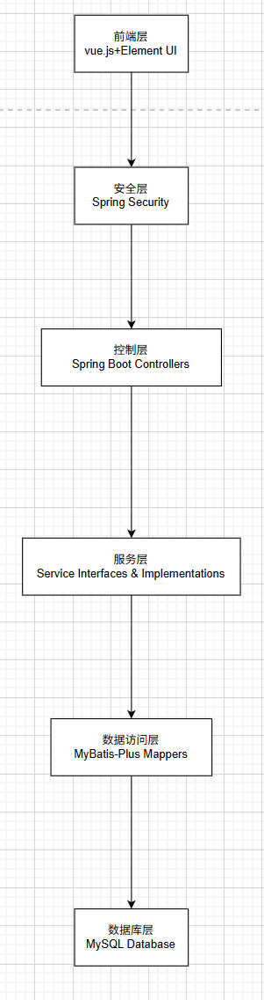
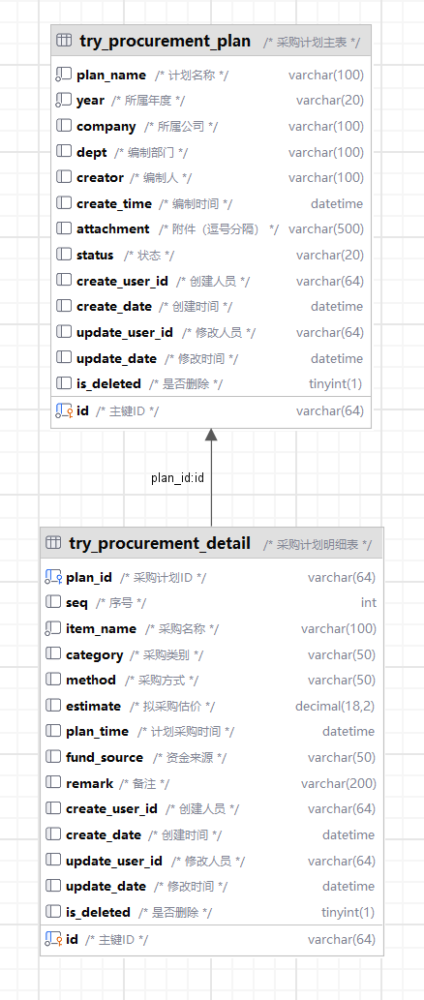
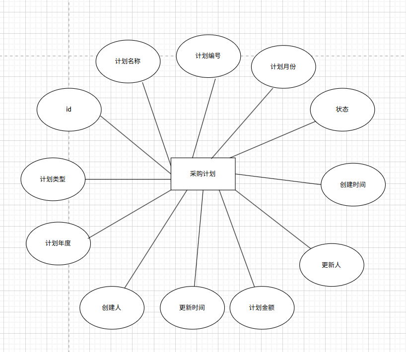
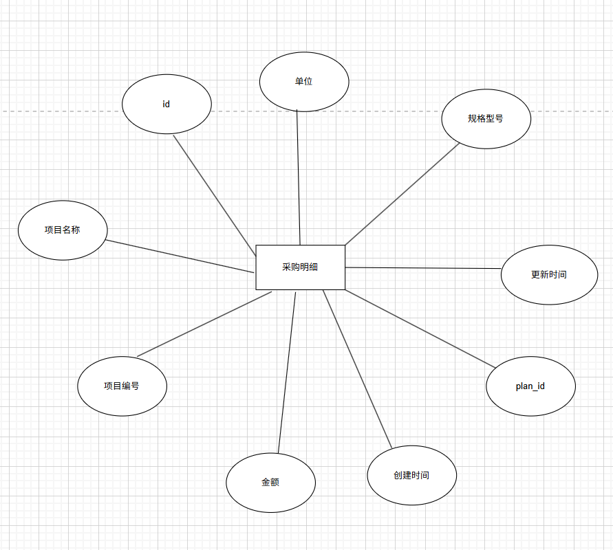
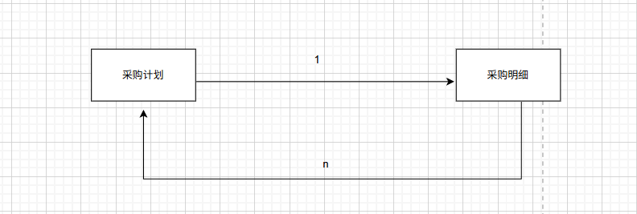

# 采购计划管理系统技术文档

## 1. 系统架构

### 1.1 技术栈
- 后端：Spring Boot 2.7.12
- 数据库：MySQL 8.0.33
- ORM框架：MyBatis-Plus 3.5.3.1
- 接口文档：Swagger 3.0.0
- Excel处理：EasyExcel 3.3.2
- 安全框架：Spring Security
- 参数校验：Hibernate Validator 6.0.13.Final
- 开发工具：Lombok
- 构建工具：Maven 3.8.1

### 1.2 前端技术栈
- 框架：Vue 2.6.11
- UI库：Element UI 2.15.13
- HTTP请求：Axios 0.21.1
- 路由：Vue Router 3.2.0
- 状态管理：Vuex 3.4.0
- 构建工具：Vue CLI 4.5.0
- 包管理：npm
- 样式处理：Sass 1.26.5
- 代码规范：ESLint 6.7.2

### 1.3 系统架构图



### 1.4 项目地址与接口文档

后端部分:

https://github.com/emmm1882/procurement-plan-backend


前端部分：
https://github.com/emmm1882/procurement-plan-front


接口文档：
项目启动成功后访问：http://localhost:8080/swagger-ui.html


## 2. 数据库设计

### 2.1 数据库表结构

#### 2.1.1 采购计划表(try_procurement_plan)
| 字段名 | 类型 | 说明 |
|--------|------|------|
| id | varchar(64) | 主键ID |
| plan_name | varchar(100) | 计划名称 |
| year | varchar(20) | 所属年度 |
| company | varchar(100) | 所属公司 |
| dept | varchar(100) | 编制部门 |
| creator | varchar(100) | 编制人 |
| create_time | datetime | 编制时间 |
| attachment | varchar(500) | 附件（逗号分隔） |
| status | varchar(20) | 状态 |
| create_user_id | varchar(64) | 创建人员 |
| create_date | datetime | 创建时间 |
| update_user_id | varchar(64) | 修改人员 |
| update_date | datetime | 修改时间 |
| is_deleted | tinyint(1) | 是否删除 |

#### 2.1.2 采购计划明细表(try_procurement_detail)
| 字段名 | 类型 | 说明 |
|--------|------|------|
| id | varchar(64) | 主键ID |
| plan_id | varchar(64) | 采购计划ID |
| seq | int | 序号 |
| item_name | varchar(100) | 采购名称 |
| category | varchar(50) | 采购类别 |
| method | varchar(50) | 采购方式 |
| estimate | decimal(18,2) | 拟采购估价 |
| plan_time | datetime | 计划采购时间 |
| fund_source | varchar(50) | 资金来源 |
| remark | varchar(200) | 备注 |
| create_user_id | varchar(64) | 创建人员 |
| create_date | datetime | 创建时间 |
| update_user_id | varchar(64) | 修改人员 |
| update_date | datetime | 修改时间 |
| is_deleted | tinyint(1) | 是否删除 |

### 2.2 数据库关系图



- 采购计划表与采购计划明细表是一对多关系
- 采购计划明细表的plan_id字段关联采购计划表的id字段
- 删除采购计划时，会级联删除其下所有采购明细

### 2.3 ER图设计

（1）采购计划实体ER图



（2）采购明细实体ER图



（3）实体关系联系图：



- 说明：
  - 一个采购计划可以包含多个采购明细（1对多关系）。
  - 采购明细表中的 plan_id 字段为外键，关联采购计划表的 id 字段。
  - 删除采购计划时，可设置级联删除其下所有采购明细

## 3. 接口设计

### 3.1 采购计划管理接口

#### 3.1.1 创建采购计划
- 请求路径：`/plan/create`
- 请求方式：POST
- 请求参数：
```json
{
    "planName": "2024年度采购计划",
    "planCode": "CG2024001",
    "planType": "年度计划",
    "planYear": 2024,
    "planMonth": 1,
    "planAmount": 100000.00,
    "details": [
        {
            "itemName": "办公用品",
            "itemCode": "BG001",
            "itemSpec": "标准规格",
            "itemUnit": "个",
            "itemQuantity": 100,
            "itemPrice": 10.00
        }
    ]
}
```
- 响应结果：
```json
{
    "code": 200,
    "message": "success",
    "data": {
        "id": "1234567890",
        "planName": "2024年度采购计划",
        "planCode": "CG2024001",
        "planType": "年度计划",
        "planYear": 2024,
        "planMonth": 1,
        "planAmount": 100000.00,
        "status": "草稿",
        "createTime": "2024-01-01 10:00:00"
    }
}
```

#### 3.1.2 查询采购计划列表
- 请求路径：`/plan/list`
- 请求方式：GET
- 请求参数：
```json
{
    "planName": "2024年度",
    "planType": "年度计划",
    "planYear": 2024,
    "status": "草稿",
    "pageNum": 1,
    "pageSize": 10
}
```
- 响应结果：
```json
{
    "code": 200,
    "message": "success",
    "data": {
        "total": 100,
        "list": [
            {
                "id": "1234567890",
                "planName": "2024年度采购计划",
                "planCode": "CG2024001",
                "planType": "年度计划",
                "planYear": 2024,
                "planMonth": 1,
                "planAmount": 100000.00,
                "status": "草稿",
                "createTime": "2024-01-01 10:00:00"
            }
        ]
    }
}
```

#### 3.1.3 修改采购计划
- 请求路径：`/plan/update`
- 请求方式：PUT
- 请求参数：
```json
{
    "id": "1234567890",
    "planName": "2024年度采购计划(修改)",
    "planAmount": 150000.00,
    "details": [
        {
            "id": "detail001",
            "itemQuantity": 150,
            "itemPrice": 15.00
        }
    ]
}
```
- 响应结果：
```json
{
    "code": 200,
    "message": "success",
    "data": null
}
```

#### 3.1.4 删除采购计划
- 请求路径：`/plan/delete/{id}`
- 请求方式：DELETE
- 响应结果：
```json
{
    "code": 200,
    "message": "success",
    "data": null
}
```

### 3.2 状态管理接口

#### 3.2.1 修改计划状态
- 请求路径：`/status/change`
- 请求方式：POST
- 请求参数：
```json
{
    "id": "1234567890",
    "status": "已审核"
}
```
- 响应结果：
```json
{
    "code": 200,
    "message": "success",
    "data": null
}
```

## 4. 关键代码实现

### 4.1 实体类定义

#### 4.1.1 采购计划实体
```java
@Data
@TableName("try_procurement_plan")
public class TryProcurementPlan {
    @TableId(type = IdType.ASSIGN_UUID)
    private String id;
    
    @NotBlank(message = "计划名称不能为空")
    @Size(max = 100, message = "计划名称长度不能超过100个字符")
    private String planName;
    
    @NotBlank(message = "所属年度不能为空")
    private String year;
    
    @Size(max = 100, message = "所属公司长度不能超过100个字符")
    private String company;
    
    @Size(max = 100, message = "编制部门长度不能超过100个字符")
    private String dept;
    
    @Size(max = 100, message = "编制人长度不能超过100个字符")
    private String creator;
    
    @JsonFormat(pattern = "yyyy-MM-dd", timezone = "GMT+8")
    private Date createTime;
    
    @Size(max = 500, message = "附件路径长度不能超过500个字符")
    private String attachment;
    
    private String status;
    private String createUserId;
    private Date createDate;
    private String updateUserId;
    private Date updateDate;
    
    @TableLogic
    private Integer isDeleted;
}

```

#### 4.1.2 采购计划明细实体
```java
@Data
@TableName("try_procurement_detail")
public class TryProcurementDetail {
    @TableId(type = IdType.ASSIGN_UUID)
    private String id;
    
    @NotBlank(message = "计划ID不能为空")
    private String planId;
    
    @ExcelProperty("序号")
    private Integer seq;
    
    @NotBlank(message = "采购名称不能为空")
    @Size(max = 100, message = "采购名称长度不能超过100个字符")
    @ExcelProperty("采购名称")
    private String itemName;
    
    @NotBlank(message = "采购类别不能为空")
    @Size(max = 50, message = "采购类别长度不能超过50个字符")
    @ExcelProperty("采购类别")
    private String category;
    
    @NotBlank(message = "采购方式不能为空")
    @Size(max = 50, message = "采购方式长度不能超过50个字符")
    @ExcelProperty("采购方式")
    private String method;
    
    @NotNull(message = "拟采购估价不能为空")
    @Min(value = 0, message = "拟采购估价不能小于0")
    @ExcelProperty("拟采购估价")
    private Double estimate;
    
    @NotNull(message = "计划采购时间不能为空")
    @ExcelProperty("计划采购时间")
    @DateTimeFormat("yyyy-MM-dd")
    @JsonFormat(pattern = "yyyy-MM-dd", timezone = "GMT+8")
    private Date planTime;
    
    @NotBlank(message = "资金来源不能为空")
    @Size(max = 50, message = "资金来源长度不能超过50个字符")
    @ExcelProperty("资金来源")
    private String fundSource;
    
    @Size(max = 200, message = "备注长度不能超过200个字符")
    @ExcelProperty("备注")
    private String remark;
    
    private String createUserId;
    private Date createDate;
    private String updateUserId;
    private Date updateDate;
    
    @TableLogic
    private Integer isDeleted;
}
```

### 4.2 服务接口与实现

#### 4.2.1 采购计划服务接口
```java
public interface TryProcurementPlanService extends IService<TryProcurementPlan> {
    // Excel导入
    Object importExcel(MultipartFile file) throws IOException;
    
    // Excel导出
    void exportExcel(HttpServletResponse response, String planName, String status) throws IOException;
}
```

#### 4.2.2 采购计划服务实现
```java
public class TryProcurementPlanServiceImpl extends ServiceImpl<TryProcurementPlanMapper, TryProcurementPlan> implements TryProcurementPlanService {
    
    @Override
    public Object importExcel(MultipartFile file) throws IOException {
        try {
            List<TryProcurementPlan> list = EasyExcel.read(file.getInputStream())
                    .head(TryProcurementPlan.class)
                    .sheet()
                    .doReadSync();
            
            // 设置默认值
            for (TryProcurementPlan plan : list) {
                plan.setStatus("DRAFT");
                plan.setIsDeleted(0);
            }
            
            // 批量保存
            this.saveBatch(list);
            return "success";
        } catch (Exception e) {
            throw new RuntimeException("导入失败：" + e.getMessage());
        }
    }

    @Override
    public void exportExcel(HttpServletResponse response, String planName, String status) throws IOException {
        try {
            // 查询数据
            QueryWrapper<TryProcurementPlan> qw = new QueryWrapper<>();
            if (planName != null && !planName.isEmpty()) qw.like("plan_name", planName);
            if (status != null && !status.isEmpty() && !"不限".equals(status)) qw.eq("status", status);
            qw.eq("is_deleted", 0);
            List<TryProcurementPlan> list = this.list(qw);

            // 设置响应头
            response.setContentType("application/vnd.ms-excel");
            response.setCharacterEncoding("utf-8");
            response.setHeader("Content-disposition", "attachment;filename=procurement_plan.xlsx");

            // 导出数据
            EasyExcel.write(response.getOutputStream(), TryProcurementPlan.class)
                    .registerWriteHandler(new LongestMatchColumnWidthStyleStrategy())
                    .sheet("采购计划")
                    .doWrite(list);
        } catch (Exception e) {
            throw new RuntimeException("导出失败：" + e.getMessage());
        }
    }
}
```

### 4.3 控制器实现

#### 4.3.1 采购计划控制器
```java
@RestController
@RequestMapping("/procurement-plans")
public class TryProcurementPlanController {
    @Autowired
    private TryProcurementPlanService planService;
    @Autowired
    private TryProcurementDetailService detailService;
    @Autowired
    private HttpServletRequest request;
    @Autowired(required = false)
    private UploadService uploadService;

    @GetMapping("/page")
    public Object page(@RequestParam int pageNum, @RequestParam int pageSize, @RequestParam(required = false) String planName, @RequestParam(required = false) String status, @RequestParam(required = false) String createUserId) {
        QueryWrapper<TryProcurementPlan> qw = new QueryWrapper<>();
        if (planName != null && !planName.isEmpty()) qw.like("plan_name", planName);
        if (status != null && !status.isEmpty() && !"不限".equals(status)) {
            // 兼容中英文状态
            if ("EFFECTIVE".equals(status) || "已生效".equals(status)) {
                qw.in("status", "EFFECTIVE", "已生效");
            } else if ("SAVED".equals(status) || "已保存".equals(status)) {
                qw.in("status", "SAVED", "已保存");
            } else if ("APPROVING".equals(status) || "审批中".equals(status)) {
                qw.in("status", "APPROVING", "审批中");
            } else if ("REJECTED".equals(status) || "审批退回".equals(status)) {
                qw.in("status", "REJECTED", "审批退回");
            } else {
                qw.eq("status", status);
            }
        }
        if (createUserId != null && !createUserId.isEmpty()) qw.eq("create_user_id", createUserId);
        qw.eq("is_deleted", 0);
        Page<TryProcurementPlan> page = new Page<>(pageNum, pageSize);
        Page<TryProcurementPlan> result = planService.page(page, qw);
        Map<String, Object> data = new HashMap<>();
        data.put("list", result.getRecords());
        data.put("total", result.getTotal());
        Map<String, Object> resp = new HashMap<>();
        resp.put("code", 0);
        resp.put("msg", "success");
        resp.put("data", data);
        return resp;
    }

    @GetMapping("/{id}")
    public Object detail(@PathVariable String id) {
        TryProcurementPlan plan = planService.getById(id);
        Map<String, Object> resp = new HashMap<>();
        resp.put("code", 0);
        resp.put("msg", "success");
        resp.put("data", plan);
        return resp;
    }

    @PostMapping
    public Object save(@RequestBody Map<String, Object> param) {
        // 1. 解析主表
        TryProcurementPlan plan = new TryProcurementPlan();
        plan.setPlanName((String) param.get("planName"));
        if (plan.getPlanName() == null || plan.getPlanName().trim().isEmpty()) {
            throw new IllegalArgumentException("采购计划名称不能为空");
        }
        plan.setYear((String) param.get("year"));
        plan.setCompany((String) param.get("company"));
        plan.setDept((String) param.get("dept"));
        plan.setCreator((String) param.get("creator"));
        plan.setAttachment((String) param.get("attachment"));
        plan.setStatus(param.get("status") != null ? mapStatusToDb(param.get("status").toString()) : "SAVED");
        plan.setCreateUserId((String) param.get("createUserId"));
        plan.setCreateDate(new Date());
        plan.setUpdateUserId((String) param.get("updateUserId"));
        plan.setUpdateDate(new Date());
        if (param.get("createTime") != null && !"".equals(param.get("createTime"))) {
            try {
                String dateStr = param.get("createTime").toString();
                if (dateStr.contains("T")) {
                    dateStr = dateStr.replace("T", " ");
                }
                if (dateStr.contains(".")) {
                    dateStr = dateStr.substring(0, dateStr.indexOf("."));
                }
                if (dateStr.length() == 10) {
                    dateStr += " 00:00:00";
                }
                plan.setCreateTime(java.sql.Timestamp.valueOf(dateStr));
            } catch (Exception e) {
                plan.setCreateTime(new Date());
            }
        } else {
            plan.setCreateTime(new Date());
        }
        planService.save(plan);
        // 2. 解析明细并保存
        if (param.get("details") instanceof List) {
            List<Map<String, Object>> details = (List<Map<String, Object>>) param.get("details");
            for (Map<String, Object> d : details) {
                TryProcurementDetail detail = new TryProcurementDetail();
                detail.setPlanId(plan.getId());
                detail.setItemName(
                    d.get("itemName") != null ? d.get("itemName").toString() :
                    (d.get("name") != null ? d.get("name").toString() : null)
                );
                detail.setCategory(d.get("category") != null ? d.get("category").toString() : null);
                detail.setMethod(d.get("method") != null ? d.get("method").toString() : null);
                if (d.get("estimate") != null && !"".equals(d.get("estimate"))) {
                    detail.setEstimate(Double.valueOf(d.get("estimate").toString()));
                } else if (d.get("estimatedAmount") != null && !"".equals(d.get("estimatedAmount"))) {
                    detail.setEstimate(Double.valueOf(d.get("estimatedAmount").toString()));
                }
                if (d.get("planTime") != null && !"".equals(d.get("planTime"))) {
                    String dateStr = d.get("planTime").toString();
                    if (dateStr.length() > 10) dateStr = dateStr.substring(0, 10);
                    detail.setPlanTime(java.sql.Date.valueOf(dateStr));
                } else if (d.get("plannedTime") != null && !"".equals(d.get("plannedTime"))) {
                    String dateStr = d.get("plannedTime").toString();
                    if (dateStr.length() > 10) dateStr = dateStr.substring(0, 10);
                    detail.setPlanTime(java.sql.Date.valueOf(dateStr));
                }
                detail.setFundSource(d.get("fundSource") != null ? d.get("fundSource").toString() : null);
                detail.setRemark(d.get("remark") != null ? d.get("remark").toString() : null);
                detailService.save(detail);
            }
        }
        Map<String, Object> resp = new HashMap<>();
        resp.put("code", 0);
        resp.put("msg", "success");
        return resp;
    }

    @PutMapping
    public Object update(@RequestBody Map<String, Object> param) {
        String id = (String) param.get("id");
        TryProcurementPlan plan = planService.getById(id);
        if (plan == null) {
            Map<String, Object> resp = new HashMap<>();
            resp.put("code", 1);
            resp.put("msg", "数据不存在");
            return resp;
        }
        if (param.get("planName") != null) plan.setPlanName((String) param.get("planName"));
        if (param.get("year") != null) plan.setYear((String) param.get("year"));
        if (param.get("company") != null) plan.setCompany((String) param.get("company"));
        if (param.get("dept") != null) plan.setDept((String) param.get("dept"));
        if (param.get("creator") != null) plan.setCreator((String) param.get("creator"));
        if (param.get("attachment") != null) plan.setAttachment((String) param.get("attachment"));
        if (param.get("status") != null) plan.setStatus(mapStatusToDb(param.get("status").toString()));
        if (param.get("createTime") != null && !"".equals(param.get("createTime"))) {
            try {
                String dateStr = param.get("createTime").toString();
                if (dateStr.contains("T")) dateStr = dateStr.replace("T", " ");
                if (dateStr.contains(".")) dateStr = dateStr.substring(0, dateStr.indexOf("."));
                if (dateStr.length() == 10) dateStr += " 00:00:00";
                plan.setCreateTime(java.sql.Timestamp.valueOf(dateStr));
            } catch (Exception e) {
                // ignore
            }
        }
        plan.setUpdateDate(new Date());
        planService.updateById(plan);
        // 明细同步更新
        if (param.get("details") instanceof List) {
            // 先删除原有明细
            detailService.remove(new QueryWrapper<TryProcurementDetail>().eq("plan_id", plan.getId()));
            // 再插入新明细
            List<Map<String, Object>> details = (List<Map<String, Object>>) param.get("details");
            for (Map<String, Object> d : details) {
                TryProcurementDetail detail = new TryProcurementDetail();
                detail.setPlanId(plan.getId());
                detail.setItemName(d.get("itemName") != null ? d.get("itemName").toString() : (d.get("name") != null ? d.get("name").toString() : null));
                detail.setCategory(d.get("category") != null ? d.get("category").toString() : null);
                detail.setMethod(d.get("method") != null ? d.get("method").toString() : null);
                if (d.get("estimate") != null && !"".equals(d.get("estimate"))) {
                    detail.setEstimate(Double.valueOf(d.get("estimate").toString()));
                } else if (d.get("estimatedAmount") != null && !"".equals(d.get("estimatedAmount"))) {
                    detail.setEstimate(Double.valueOf(d.get("estimatedAmount").toString()));
                }
                if (d.get("planTime") != null && !"".equals(d.get("planTime"))) {
                    String dateStr = d.get("planTime").toString();
                    if (dateStr.length() > 10) dateStr = dateStr.substring(0, 10);
                    detail.setPlanTime(java.sql.Date.valueOf(dateStr));
                } else if (d.get("plannedTime") != null && !"".equals(d.get("plannedTime"))) {
                    String dateStr = d.get("plannedTime").toString();
                    if (dateStr.length() > 10) dateStr = dateStr.substring(0, 10);
                    detail.setPlanTime(java.sql.Date.valueOf(dateStr));
                }
                detail.setFundSource(d.get("fundSource") != null ? d.get("fundSource").toString() : null);
                detail.setRemark(d.get("remark") != null ? d.get("remark").toString() : null);
                detailService.save(detail);
            }
        }
        Map<String, Object> resp = new HashMap<>();
        resp.put("code", 0);
        resp.put("msg", "success");
        return resp;
    }

    @PostMapping("/update")
    public Object updateByPost(@RequestBody Map<String, Object> param) {
        return update(param);
    }

    @DeleteMapping("/{id}")
    public Object delete(@PathVariable String id) {
        boolean removed = planService.removeById(id);
        Map<String, Object> resp = new HashMap<>();
        if (removed) {
            resp.put("code", 0);
            resp.put("msg", "success");
        } else {
            resp.put("code", 1);
            resp.put("msg", "删除失败，数据不存在或已被删除");
        }
        return resp;
    }

    @PostMapping("/import")
    public Object importExcel(@RequestParam("file") MultipartFile file) throws IOException {
        return planService.importExcel(file);
    }

    @GetMapping("/export")
    public void exportExcel(HttpServletResponse response, 
                          @RequestParam(required = false) String planName,
                          @RequestParam(required = false) String status) throws IOException {
        planService.exportExcel(response, planName, status);
    }

    @PostMapping("/upload")
    public Object uploadFile(@RequestParam("file") MultipartFile file) {
        if (file.isEmpty()) {
            return new HashMap<String, Object>() {{
                put("code", 1);
                put("msg", "文件为空");
            }};
        }
        
        // 检查文件大小
        long fileSize = file.getSize();
        if (fileSize > 100 * 1024 * 1024) { // 100MB
            return new HashMap<String, Object>() {{
                put("code", 1);
                put("msg", "文件大小不能超过100MB");
            }};
        }
        
        // 检查文件数量
        String planId = request.getParameter("planId");
        if (planId != null) {
            TryProcurementPlan plan = planService.getById(planId);
            if (plan != null && plan.getAttachment() != null) {
                String[] existingFiles = plan.getAttachment().split(",");
                if (existingFiles.length >= 5) {
                    return new HashMap<String, Object>() {{
                        put("code", 1);
                        put("msg", "每个计划最多上传5个附件");
                    }};
                }
            }
        }
        
        try {
            // 处理文件上传逻辑
            String originalFilename = file.getOriginalFilename();
            String filePath = uploadService.saveFile(file);
            
            // 更新计划的附件字段
            if (planId != null) {
                TryProcurementPlan plan = planService.getById(planId);
                if (plan != null) {
                    String attachment = plan.getAttachment();
                    if (attachment == null || attachment.isEmpty()) {
                        attachment = filePath;
                    } else {
                        attachment += "," + filePath;
                    }
                    plan.setAttachment(attachment);
                    planService.updateById(plan);
                }
            }
            
            return new HashMap<String, Object>() {{
                put("code", 0);
                put("msg", "success");
                put("data", new HashMap<String, String>() {{
                    put("filePath", filePath);
                    put("fileName", originalFilename);
                }});
            }};
        } catch (Exception e) {
            return new HashMap<String, Object>() {{
                put("code", 1);
                put("msg", "文件上传失败：" + e.getMessage());
            }};
        }
    }

    @PutMapping("/{id}/status")
    public Object updateStatus(@PathVariable String id, @RequestParam String status) {
        TryProcurementPlan plan = planService.getById(id);
        if (plan == null) {
            return new HashMap<String, Object>() {{
                put("code", 1);
                put("msg", "计划不存在");
            }};
        }
        
        // 状态流转校验
        if (!isValidStatusTransition(plan.getStatus(), status)) {
            return new HashMap<String, Object>() {{
                put("code", 1);
                put("msg", "非法的状态转换");
            }};
        }
        
        plan.setStatus(status);
        plan.setUpdateDate(new Date());
        planService.updateById(plan);
        
        return new HashMap<String, Object>() {{
            put("code", 0);
            put("msg", "success");
        }};
    }

    private boolean isValidStatusTransition(String currentStatus, String targetStatus) {
        // 定义状态流转规则
        Map<String, List<String>> statusFlow = new HashMap<>();
        statusFlow.put("已保存", Arrays.asList("审批中", "已删除"));
        statusFlow.put("审批中", Arrays.asList("已生效", "审批退回"));
        statusFlow.put("审批退回", Arrays.asList("已保存", "已删除"));
        statusFlow.put("已生效", Arrays.asList());
        
        List<String> allowedTransitions = statusFlow.get(currentStatus);
        return allowedTransitions != null && allowedTransitions.contains(targetStatus);
    }

    private String mapStatusToDb(String status) {
        if ("已生效".equals(status)) return "EFFECTIVE";
        if ("已保存".equals(status)) return "SAVED";
        if ("审批中".equals(status)) return "APPROVING";
        if ("审批退回".equals(status)) return "REJECTED";
        return status;
    }
}

```

### 4.4 接口说明

#### 4.4.1 采购计划管理接口

1. 分页查询采购计划列表
- 请求路径：`/procurement-plans/page`
- 请求方式：GET
- 请求参数：
  - pageNum：页码
  - pageSize：每页大小
  - planName：计划名称（可选）
  - status：状态（可选）
  - createUserId：创建人ID（可选）
- 响应结果：
```json
{
    "code": 0,
    "msg": "success",
    "data": {
        "list": [
            {
                "id": "xxx",
                "planName": "2024年度采购计划",
                "year": "2024",
                "company": "测试公司",
                "dept": "测试部门",
                "creator": "测试人员",
                "createTime": "2024-01-01",
                "status": "SAVED"
            }
        ],
        "total": 100
    }
}
```

2. 获取采购计划详情
- 请求路径：`/procurement-plans/{id}`
- 请求方式：GET
- 响应结果：
```json
{
    "code": 0,
    "msg": "success",
    "data": {
        "id": "xxx",
        "planName": "2024年度采购计划",
        "year": "2024",
        "company": "测试公司",
        "dept": "测试部门",
        "creator": "测试人员",
        "createTime": "2024-01-01",
        "status": "SAVED"
    }
}
```

3. 保存采购计划
- 请求路径：`/procurement-plans`
- 请求方式：POST
- 请求参数：
```json
{
    "planName": "2024年度采购计划",
    "year": "2024",
    "company": "测试公司",
    "dept": "测试部门",
    "creator": "测试人员",
    "status": "SAVED",
    "details": [
        {
            "itemName": "办公用品",
            "category": "B01",
            "method": "竞价采购",
            "estimate": 1000.00,
            "planTime": "2024-01-01",
            "fundSource": "自筹",
            "remark": "备注"
        }
    ]
}
```

4. 更新采购计划
- 请求路径：`/procurement-plans`
- 请求方式：PUT
- 请求参数：同保存接口

5. 删除采购计划
- 请求路径：`/procurement-plans/{id}`
- 请求方式：DELETE

6. Excel导入
- 请求路径：`/procurement-plans/import`
- 请求方式：POST
- 请求参数：file（Excel文件）

7. Excel导出
- 请求路径：`/procurement-plans/export`
- 请求方式：GET
- 请求参数：
  - planName：计划名称（可选）
  - status：状态（可选）

8. 文件上传
- 请求路径：`/procurement-plans/upload`
- 请求方式：POST
- 请求参数：file（文件）

9. 更新计划状态
- 请求路径：`/procurement-plans/{id}/status`
- 请求方式：PUT
- 请求参数：
  - status：新状态

## 5. 前端实现

### 5.1 前端目录结构
```
procurement-plan-front/
├── src/             # 源代码
│   ├── api/         # API请求
│   ├── views/       # 页面
│   │   ├── plan/    # 采购计划相关页面
│   │   ├── PlanForm.vue    # 计划表单
│   │   ├── PlanList.vue    # 计划列表
│   │   └── PlanDetail.vue  # 计划详情
│   ├── router/      # 路由
│   ├── store/       # Vuex状态管理
│   ├── utils/       # 工具
│   ├── styles/      # 样式
│   ├── layout/      # 布局
│   ├── App.vue      # 根组件
│   └── main.js      # 入口文件
├── docs/            # 文档
├── package.json     # 项目配置
├── package-lock.json # 依赖锁定
├── vue.config.js    # Vue配置
└── README.md        # 项目说明
```

### 5.2 关键代码实现

#### 5.2.1 新增计划页面
```vue
<template>
  <div class="plan-add">
    <el-card class="box-card">
      <div slot="header" class="clearfix">
        <span>新增采购计划</span>
        <el-button style="float: right; padding: 3px 0" type="text" @click="goBack">返回</el-button>
      </div>
      
      <el-form ref="form" :model="form" :rules="rules" label-width="100px">
        <el-form-item label="计划名称" prop="planName">
          <el-input v-model="form.planName" placeholder="请输入计划名称" />
        </el-form-item>
        <el-form-item label="所属年度" prop="year">
          <el-row :gutter="10">
            <el-col :span="8">
              <el-select v-model="yearValue" placeholder="请选择年份">
                <el-option v-for="item in yearList" :key="item" :label="item+'年'" :value="item" />
              </el-select>
            </el-col>
            <el-col :span="10">
              <el-select v-model="periodValue" placeholder="请选择时间段">
                <el-option v-for="item in periodList" :key="item" :label="item" :value="item" />
              </el-select>
            </el-col>
          </el-row>
        </el-form-item>
        <el-form-item label="所属公司">
          <el-input v-model="form.company" placeholder="自动带入/可编辑" />
        </el-form-item>
        <el-form-item label="编制部门">
          <el-input v-model="form.dept" placeholder="自动带入/可编辑" />
        </el-form-item>
        <el-form-item label="编制人">
          <el-input v-model="form.creator" placeholder="自动带入/可编辑" />
        </el-form-item>
        <el-form-item label="编制时间">
          <el-date-picker v-model="form.createTime" type="date" value-format="yyyy-MM-dd" format="yyyy-MM-dd" placeholder="自动带入" style="width: 100%;" />
        </el-form-item>
        <el-form-item label="附件">
          <el-upload
            class="upload-demo"
            action="/api/attachment/upload"
            :on-success="handleUploadSuccess"
            :file-list="fileList"
            :limit="5"
            :on-exceed="handleExceed"
            :before-upload="beforeUpload">
            <el-button size="small" type="primary">上传文件</el-button>
            <div slot="tip" class="el-upload__tip">文件不超过5个，且单个文件不超过100M</div>
          </el-upload>
        </el-form-item>
        <el-form-item label="计划明细">
          <div class="detail-toolbar">
            <el-button type="primary" size="small" @click="handleAddDetail">新增</el-button>
            <el-button type="success" size="small" @click="showImportDialog = true">明细导入</el-button>
            <el-button type="warning" size="small" @click="handleExport">明细导出</el-button>
          </div>
          <el-table :data="form.details" border style="width: 100%">
            <el-table-column type="index" label="序号" width="50" />
            <el-table-column label="采购名称" prop="itemName" width="200">
              <template slot-scope="scope">
                <el-input v-model="scope.row.itemName" placeholder="请输入采购名称" style="width:100%" />
              </template>
            </el-table-column>
            <el-table-column label="采购类别" prop="category" width="140">
              <template slot-scope="scope">
                <el-select v-model="scope.row.category" placeholder="请选择" style="width:100%">
                  <el-option label="B01 材料设备" value="B01 材料设备" />
                  <el-option label="B02 服务" value="B02 服务" />
                  <el-option label="B03 工程" value="B03 工程" />
                </el-select>
              </template>
            </el-table-column>
            <el-table-column label="采购方式" prop="method" width="140">
              <template slot-scope="scope">
                <el-select v-model="scope.row.method" placeholder="请选择" style="width:100%">
                  <el-option label="竞价采购" value="竞价采购" />
                  <el-option label="公开招标" value="公开招标" />
                  <el-option label="单一来源" value="单一来源" />
                </el-select>
              </template>
            </el-table-column>
            <el-table-column label="拟采购估价" prop="estimate" width="150">
              <template slot-scope="scope">
                <el-input-number v-model="scope.row.estimate" :min="0" style="width:150px; text-align:right;" />
                <span>元</span>
              </template>
            </el-table-column>
            <el-table-column label="计划采购时间" prop="planTime" width="150">
              <template slot-scope="scope">
                <el-date-picker v-model="scope.row.planTime" type="date" value-format="yyyy-MM-dd" format="yyyy-MM-dd" placeholder="选择日期" style="width:100%" />
              </template>
            </el-table-column>
            <el-table-column label="资金来源" prop="fundSource" width="120">
              <template slot-scope="scope">
                <el-select v-model="scope.row.fundSource" placeholder="请选择" style="width:100%">
                  <el-option label="自筹" value="自筹" />
                  <el-option label="拨款" value="拨款" />
                  <el-option label="其他" value="其他" />
                </el-select>
              </template>
            </el-table-column>
            <el-table-column label="备注" prop="remark" width="120">
              <template slot-scope="scope">
                <el-input v-model="scope.row.remark" placeholder="请输入备注" style="width:100%" />
              </template>
            </el-table-column>
            <el-table-column label="操作" width="80">
              <template slot-scope="scope">
                <el-button size="mini" type="danger" @click="handleDeleteDetail(scope.$index)">删除</el-button>
              </template>
            </el-table-column>
          </el-table>
        </el-form-item>
        <el-form-item>
          <el-button type="primary" @click="submitForm">保存</el-button>
          <el-button type="success" @click="submitForm('effect')">生效</el-button>
          <el-button @click="goBack">取消</el-button>
        </el-form-item>
      </el-form>
    </el-card>
    <import-dialog
      v-if="showImportDialog"
      :value="showImportDialog"
      :import-url="`/api/excel/import/${form.id}`"
      @close="showImportDialog = false"
      @imported="onImportDetail"
    />
  </div>
</template>

<script>
import { createPlan, addPlan, importPlanDetails, exportPlanDetails } from '@/api/plan'
import ImportDialog from './ImportDialog.vue'
import moment from 'moment'

export default {
  name: 'PlanAdd',
  components: { ImportDialog },
  data() {
    return {
      form: {
        planName: '',
        year: '',
        company: '',
        dept: '',
        creator: '',
        createTime: new Date().toISOString().substr(0, 10),
        attachment: '',
        details: []
      },
      rules: {
        planName: [
          { required: true, message: '请输入计划名称', trigger: 'blur' }
        ],
        year: [
          { required: true, message: '请选择所属年度', trigger: 'change' }
        ]
      },
      yearList: this.generateYearList(),
      periodList: ['年度', '上半年', '下半年', '一季度'],
      yearValue: '',
      periodValue: '',
      fileList: [],
      uploadUrl: process.env.VUE_APP_BASE_API + '/procurement-plans/attachments',
      uploadHeaders: {
        // 如果需要认证token
        // Authorization: 'Bearer ' + getToken()
      },
      showImportDialog: false
    }
  },
  watch: {
    yearValue(val) { this.updateYearField(); },
    periodValue(val) { this.updateYearField(); },
  },
  methods: {
    generateYearList() {
      const now = new Date();
      const currentYear = now.getFullYear();
      return [currentYear, currentYear + 1, currentYear + 2];
    },
    updateYearField() {
      if (this.yearValue && this.periodValue) {
        this.form.year = `${this.yearValue}年/${this.periodValue}`;
      } else {
        this.form.year = '';
      }
    },
    handleAddDetail() {
      this.form.details.push({
        name: '',
        category: '',
        method: '',
        estimatedAmount: 0,
        plannedTime: '',
        fundSource: '',
        remark: ''
      })
    },
    handleDeleteDetail(index) {
      this.form.details.splice(index, 1)
    },
    onImportDetail() {
      // 导入成功后刷新明细
      this.getDetail()
    },
    handleExport() {
      const id = this.form.id
      if (!id) {
        this.$message.error('请先保存主表后再导出明细')
        return
      }
      exportPlanDetails(id).then(res => {
        const blob = new Blob([res], { type: 'application/vnd.ms-excel' })
        const url = window.URL.createObjectURL(blob)
        const a = document.createElement('a')
        a.href = url
        a.download = '计划明细导出.xlsx'
        a.click()
        window.URL.revokeObjectURL(url)
      })
    },
    handleUploadSuccess(response, file, fileList) {
      // response: {originName, filename}
      this.form.attachment = fileList
        .map(f => {
          const r = f.response || {};
          return r.originName && r.filename ? `${r.originName}:${r.filename}` : '';
        })
        .filter(Boolean)
        .join(',');
      this.$message.success('上传成功')
    },
    handleUploadError() {
      this.$message.error('上传失败')
    },
    handleExceed(files, fileList) {
      this.$message.warning('最多只能上传5个文件')
    },
    beforeUpload(file) {
      const isLt100M = file.size / 1024 / 1024 < 100
      if (!isLt100M) {
        this.$message.error('单个文件不能超过100M')
      }
      return isLt100M
    },
    submitForm(type) {
      this.$refs.form.validate(valid => {
        if (!valid) return
        if (!this.form.details || this.form.details.length === 0) {
          this.$message.error('请至少填写一条计划明细')
          return
        }
        // 直接拼接' 00:00:00'，不再用moment
        let createTime = this.form.createTime
        if (createTime && /^\d{4}-\d{2}-\d{2}$/.test(createTime)) {
          createTime = createTime + ' 00:00:00'
        }
        const details = this.form.details.map(d => ({
          itemName: d.itemName || d.name || '',
          category: d.category || '',
          method: d.method || '',
          estimate: d.estimate || d.estimatedAmount || 0,
          planTime: d.planTime && /^\d{4}-\d{2}-\d{2}$/.test(d.planTime) ? d.planTime + ' 00:00:00' : d.planTime || d.plannedTime || '',
          fundSource: d.fundSource || '',
          remark: d.remark || ''
        }))
        const status = type === 'effect' ? '已生效' : '已保存'
        addPlan({ ...this.form, createTime, details, status }).then(() => {
          this.$message.success(type === 'effect' ? '生效成功' : '保存成功')
          this.$router.push({ name: 'PlanList' })
        })
      })
    },
    goBack() {
      this.$router.push('/plan/list')
    }
  },
  mounted() {
    // 编辑时自动拆分
    if (this.form.year) {
      const match = this.form.year.match(/(\d{4})年\/(.+)/);
      if (match) {
        this.yearValue = match[1];
        this.periodValue = match[2];
      }
    }
  }
}
</script>

<style lang="scss" scoped>
.plan-add {
  padding: 20px;
}
.box-card {
  margin-bottom: 20px;
}
.detail-toolbar {
  margin-bottom: 20px;
}
.el-input__inner {
  text-align: center;
}
</style>
```

### 5.3 部署说明

#### 5.3.1 环境要求
- Node.js 14+
- npm 6+
- Vue CLI 4.5.0

#### 5.3.2 部署步骤
1. 安装依赖：
```bash
npm install
```

2. 启动开发服务器：
```bash
npm run serve
```

3. 构建生产环境：
```bash
npm run build
```

#### 5.3.3 配置文件说明
```js
// vue.config.js
module.exports = {
  devServer: {
    port: 8080,
    proxy: {
      '/api': {
        target: 'http://localhost:8080',
        changeOrigin: true
      }
    }
  }
}
```

#### 5.3.4 项目依赖说明
```json
{
  "dependencies": {
    "axios": "^0.21.1",
    "core-js": "^3.6.5",
    "element-ui": "^2.15.13",
    "moment": "^2.30.1",
    "vue": "^2.6.11",
    "vue-router": "^3.2.0",
    "vuex": "^3.4.0"
  },
  "devDependencies": {
    "@vue/cli-plugin-babel": "~4.5.0",
    "@vue/cli-plugin-eslint": "~4.5.0",
    "@vue/cli-plugin-router": "~4.5.0",
    "@vue/cli-plugin-vuex": "~4.5.0",
    "@vue/cli-service": "~4.5.0",
    "babel-eslint": "^10.1.0",
    "eslint": "^6.7.2",
    "eslint-plugin-vue": "^6.2.2",
    "sass": "^1.26.5",
    "sass-loader": "^8.0.2",
    "vue-template-compiler": "^2.6.11"
  }
}
```

## 6. 部署说明

### 6.1 环境要求
- JDK 1.8+
- MySQL 8.0+
- Maven 3.8.1+
- Node.js 14+

### 6.2 部署步骤
1. 克隆项目代码
2. 执行数据库脚本
3. 修改配置文件
4. 编译打包
5. 运行应用

### 6.3 配置文件说明
```yaml
server:
  port: 8080

spring:
  datasource:
    url: jdbc:mysql://localhost:3306/procurement_plan?useUnicode=true&characterEncoding=utf-8&serverTimezone=Asia/Shanghai
    username: root
    password: 123456
    driver-class-name: com.mysql.cj.jdbc.Driver

mybatis-plus:
  mapper-locations: classpath:mapper/*.xml
  type-aliases-package: com.ittry.entity
  configuration:
    map-underscore-to-camel-case: true
  global-config:
    db-config:
      id-type: assign_id
      logic-delete-field: deleted
      logic-delete-value: 1
      logic-not-delete-value: 0
```
